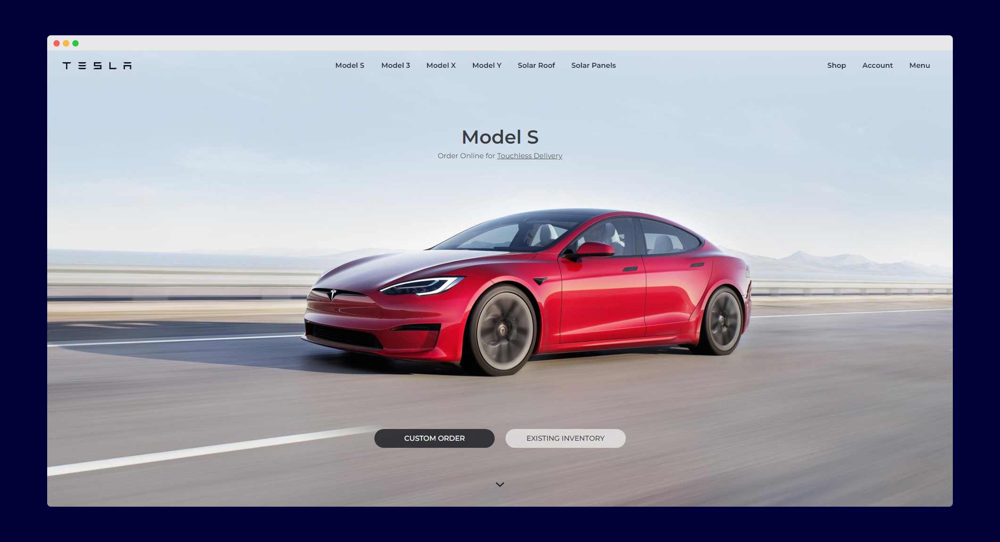

<h1 align="center">
  Tesla clone
</h1>
<!--
<h2 align="center">
  Travel to San Francisco Safely
</h2> -->

  

## 💻 Projeto

Evento maratona starter [Code Bless You](https://www.youtube.com/c/CodeBlessYou) .

Dependências usadas no projeto:
-  [Html](https://developer.mozilla.org/pt-BR/docs/Web/HTML)
-  [Tailwind](https://tailwindcss.com/)

## Crédito

-  [Youtube - Code Bless You](https://www.youtube.com/c/CodeBlessYou)

# ⌨️ Autores

<table>
  <tr>
    <td align="center">
      <a href="https://github.com/pedroGermano">
        
         
        
          <b>Pedro Germano</b>
        
       </a>
        
       <a href="https://www.linkedin.com/in/pedrogermano232/" title="Linkedin">@pedroGermano</a>
        
       <a href="#" title="Code">💻</a>
    </td>
    <td align="center">
      <a href="https://www.youtube.com/c/CodeBlessYou">
        
         
        
          <b>Code Bless You</b>
        
       </a>
        
       <a href="https://www.youtube.com/c/CodeBlessYou" title="youtube">Code Bless You</a>
        
        <a href="#" title="Code">💻</a>
    </td>
  </tr>
</table>

## 📥 Instalação e execução

Faça um clone desse repositório e acesse o diretório.